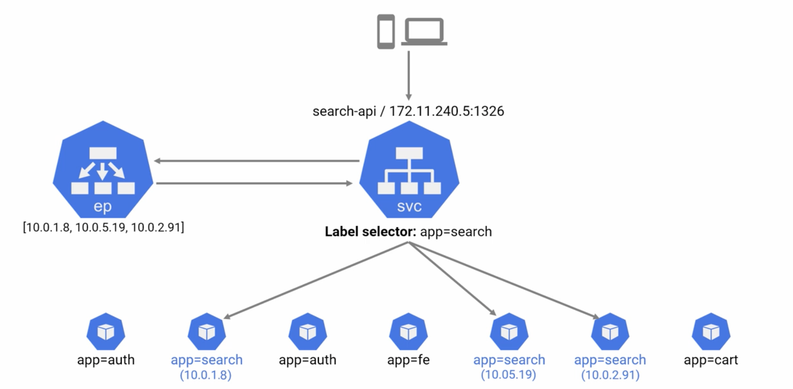
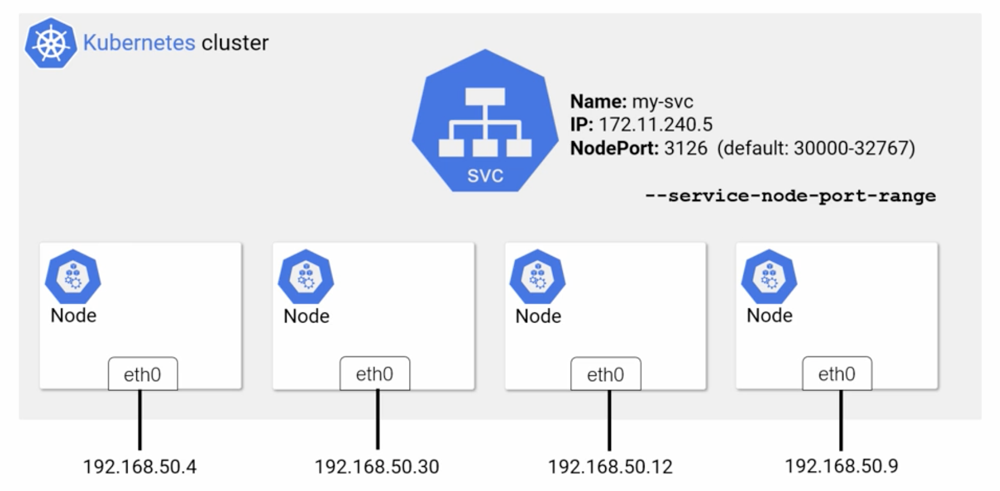
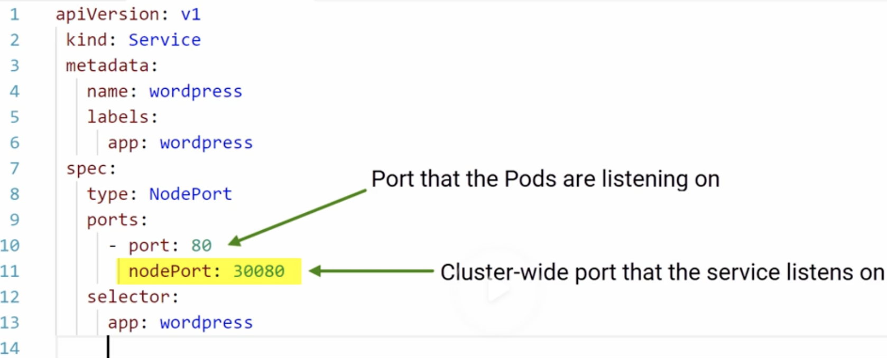

# Kubernetes:

K8s - stands for kubernetes. 8 is no of letters between k and s.

K8s - open source platform to run cloud native apps

K8s -> Contorl plane and Workers

### Contorl plane:
  - api server, scheduler, controlers, etcd
  - etcd - Stateful cluster in control plane
  - api server server: all operations goes through api server

### API:
  - Everything in K8s is registered in API.
  - its RESTfull API with CRUD operations (Create, Read, Update and Delete)
  - Run commands using "kubectl"

### API Groups:
  1) Core API
  2) Apps API
  3) Authorization API
  4) Storage API

eg: kubectl get apiservices

***************************************
## Kubernetes Objects:

K8s doesnt run a container directly.
it wraps in "POD" - smallest thing to deploy in K8s
Pod is object on the cluster and defined in Apps/V1 API group.
Pods wraps one or more containers

kubectl get nodes

***************************************
## Kubernetes Networking:

Rules: All nodes can talk, All pods can communicate with eachother and Every pods gets its own IP

Two Networks:
Node Network  and POD Network
Pod Network - provides CNI plugin (container network interface), it is big and flat streach across all Nodes, All nodes has IP on it.

Service object (in yaml file, like load balancer in aws) is the Stable Network abstraction for all the pods. 
Kubernetes gaurentes Name and IP of Service object until its life time. 

Service has End point object which stores all the entires of the service to match its selector: 

Different types of Service:
 1) ClusterIP - Default 
 2) NodePort - gets cluster wide port accessable from outside of cluster
    - 
    - 
 3) LoadBalancer

Kube-proxy
its the process which runs on every Node. Its job is to writes IPTABLES or IPVS rules. 
- 2 types: IPTABLES Mode and IPVS Mode

